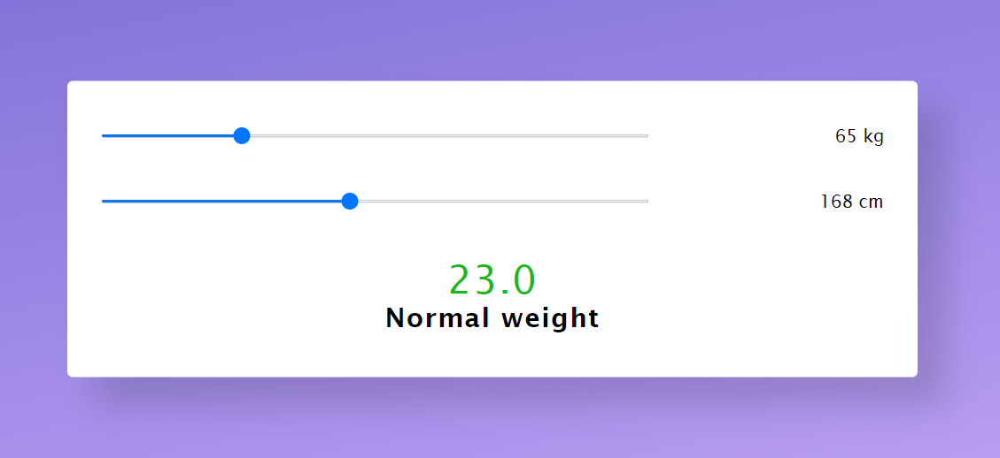

Aplikácia na výpočet BMI indexu.
Po zadaní hmotnosti a výšky dostanete hodnotu BMI indexu.

Ak je výsledná hodnota:
do 18,5: podvýživa
18,5 – 24,9: ideálna a zdravá váha
25 – 29,9: nadváha
30 a viac: obezita

Aplikácia bola vytvorená pomocou online tutoriálu.

